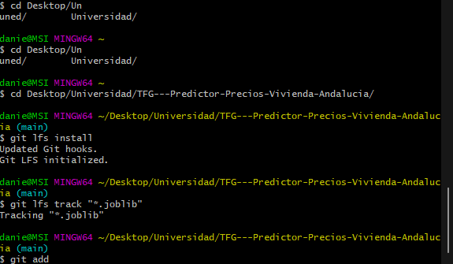

# Resumen TFG Daniel Carrera Bonilla

TFG enfocado en el desarrollo y análisis de una plataforma predictiva de precios inmobiliarios para las provincias de Andalucía, utilizando técnicas de Machine Learning y Big Data.

## Enlaces de interés

- Repositorio github: https://github.com/danielcb0/TFG---Predictor-Precios-Vivienda-Andalucia
- Overleaf para memoria prácticas: https://www.overleaf.com/5811387216kmwbbwrtjpxt#d348c0
- Despligue aplicación (inactiva debido al tamaño de procesamiento del modelo que excede el plan gratuito): https://tfg-predictor-precios-vivienda-andalucia.onrender.com/predict
- API: https://rapidapi.com/apidojo/api/idealista2

## Estructura
La **estructura del proyecto** se organiza en los siguientes directorios principales:

### Carpeta Data
`data/`: Contiene los scripts para:
- La extracción de los datos mediante la api de rapid api de Idealista( `extraccionViviendasMensualv2.py`)
- Preprocesamiento para coger los datos crudos de todos los CSVs que se generan en la extracción, fusionarlos y conseguir un único csv(`preprocess.py`). 
- El almacenamiento de datos crudos (`raw/`), procesados (`processed/`) y limpios después de pasar por una serie de acciones en un notebook (`clean/`).
    

### Carpeta Notebooks 
`notebooks/`: Incluye los cuadernos de Jupyter para:
- El análisis exploratorio de datos por provincias ([`analisis_visualizacion_por_provincia.ipynb`])
- Análisis general del dataset ([`analisis_visualizacion v2.ipynb`]).
- La carga y limpieza del dataset de la carpeta processed se da en ([`carga_limpieza.ipynb`]).
- El desarrollo y la generación de modelos se da en el notebook ([`model_testing v3.ipynb`]).

#### Power BI
Como extra al análisis de nuestros datos he diseñado un cuadro de mando que nos pueda aportar una serie de datos directos sobre el dataset.

### Carpeta Models
*   `models/`: 
*   Contiene los modelos entrenados.

### Carpeta Backend
*   `backend/`: Contiene la lógica de la aplicación del lado del servidor ([`app.py`]). Desarrollada con flask y flask-cors. Se crea una pequeña API que consume el modelo.
### Carpeta Backend
*   `frontend/`: Incluye los archivos de la interfaz de usuario ([`index.html`]).

La aplicación web es sencilla marcada por dos partes:
- Ruta para acceder al modelo predictor
- Ruta para acceder a los estudios de los datos con los que trabajamos (notebooks exportados a HTML)

El mapa con el que se obitenen las coordenadas está limitado para mostrar únicamente (y lo más preciso posible) solamente la parte de andalucía.

La idea es que la aplicación se despligue en un host gratuito como renders. Ahora mismo está ya, sin embargo, por el creciente tamaño del modelo este ha provocado que se superen los recursos de memoria RAM que proporciona el plan gratuito. Ahora mismo tengo dos opciones, pagar 25$ o disminuir el tamaño del modelo optando por recortar ramas y partes del algoritmo que se elige ahora mismo, RandomForest, o escoger otro algoritmo que genere un modelo más liviano.

*   `docs/`: Contiene la documentación del proyecto

*   Otros archivos relevantes incluyen `Dockerfile`, `docker-compose.yml` para la contenerización (no dockerizado aún) y `requirements.txt` para las dependencias.

Las **partes o fases principales del proyecto** son:
1.  **Introducción y Extracción de Datos:** Definición del alcance del proyecto y desarrollo de scripts para la recopilación automatizada de datos inmobiliarios de Andalucía.
2.  **Preprocesamiento y Limpieza de Datos:** Transformación de los datos crudos en un formato limpio y estructurado, adecuado para el análisis y modelado. Esto incluye la gestión de valores nulos, la corrección de tipos de datos y la ingeniería de características.
3.  **Análisis Exploratorio de Datos (EDA):** Investigación de los datos para descubrir patrones, tendencias, anomalías y relaciones entre variables, con el fin de obtener una comprensión profunda del mercado inmobiliario andaluz.
4.  **Desarrollo y Evaluación de Modelos de Machine Learning:** Entrenamiento de diversos modelos predictivos (regresión) para estimar los precios de las viviendas. Se realiza una selección de características, optimización de hiperparámetros y evaluación exhaustiva para elegir los modelos con mejor rendimiento para cada provincia. Se presta especial atención a características geográficas como latitud y longitud.
5.  **Implementación de la Plataforma Web:**
    *   **Backend:** Desarrollo de una API para servir las predicciones de los modelos.
    *   **Frontend:** Creación de una interfaz de usuario interactiva que permita a los usuarios introducir características de una vivienda (superficie, habitaciones, ubicación en un mapa, etc.) y obtener una predicción de precio.
6.  **Documentación y Presentación de Resultados:** Elaboración de la memoria del TFG, incluyendo la descripción detallada de cada fase, los resultados obtenidos y las conclusiones del proyecto.
   

