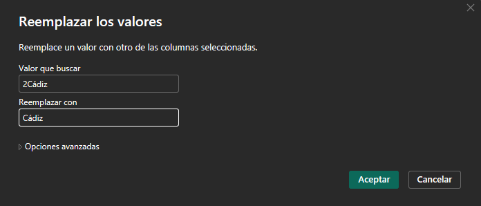
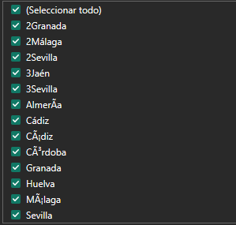
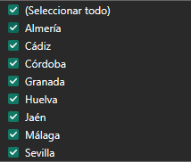
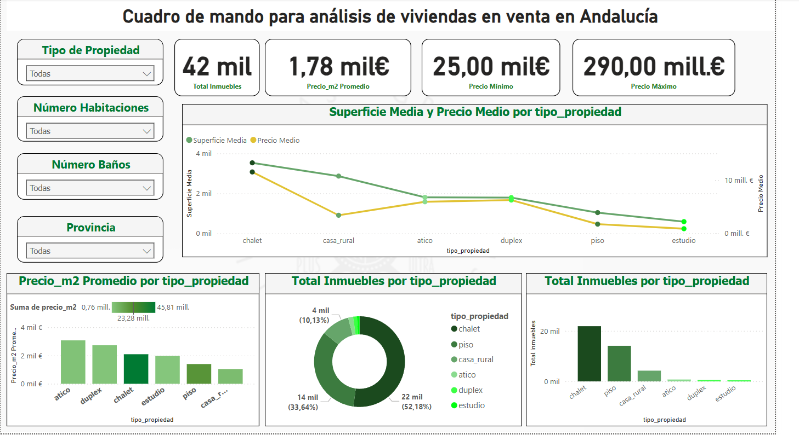

Pasos seguidos en cuadro mando power bi

1. Carga y transformación datos
Uno de los pasos que anteriormente hicimos fue añadir una columna provincia. Algunos de esos datos no son correctos ya que se les ah añadido un 2 delante del nombre de la provincia. Con powerbi limpiamos esos

También se han cambiado las columnas precio_m2 y densidad_habitaciones ya que se estaba usando el punto como el separador decimal en vez de la coma

También se ha especificado que el campo precio es un campo moneda €

2.

Se ha creado un fondo para las distintas pestañas del cuadro de mando

Color para los títulos elegidos: #007A33

Una serie de medidas dax: 
Total Inmuebles: cuenta cuántos registros (propiedades) hay en el dataset.
DAX: Total Inmuebles = COUNTROWS(Inmuebles)
Explicación: COUNTROWS cuenta las filas de la tabla Inmuebles, dando el total de propiedades listadas.
Precio Medio: calcula el precio promedio de las propiedades.
DAX: Precio Medio = AVERAGE(Inmuebles[precio])
Explicación: AVERAGE toma la media aritmética de la columna de precio. Formatea esta medida como moneda (Euro) con uno o dos decimales según prefieras.
Precio Mínimo: el precio más bajo en el dataset.
DAX: Precio Mínimo = MIN(Inmuebles[precio])
Precio Máximo: el precio más alto registrado.
DAX: Precio Máximo = MAX(Inmuebles[precio])
Superficie Media: promedio de metros cuadrados de las propiedades.
DAX: Superficie Media = AVERAGE(Inmuebles[superficie])
Explicación: tamaño medio de las viviendas, útil para entender el promedio de superficie.
Precio por m² Promedio: precio medio por metro cuadrado.
DAX: Precio_m2 Promedio = AVERAGE(Inmuebles[precio_m2])
Explicación: dado que ya existe la columna precio_m2 por registro, simplemente promediamos esa columna. (Alternativamente, podrías calcularlo dividiendo sumatorio de precio entre sumatorio de superficie con DAX, pero al estar precalculado por fila es suficiente con AVERAGE).
Habitaciones Promedio (opcional): si te interesa saber el promedio de habitaciones.
DAX: Habitaciones Promedio = AVERAGE(Inmuebles[habitaciones])
Explicación: número medio de habitaciones (~ indicador del tamaño típico de las viviendas).

Se añaden los siguientes gráficos:

Inserta un gráfico de columnas (barras verticales) con: Eje = Province (provincia) y Valor = Total Inmuebles (conteo). Esto mostrará, por ejemplo, cuántos inmuebles hay en Málaga, Sevilla, Cádiz, etc., permitiendo identificar qué provincias tienen más oferta en el dataset. Ordena las barras de mayor a menor para resaltar la provincia con mayor número de propiedades.

Añade otro gráfico de columnas (junto o abajo del anterior) para Precio medio por provincia: Eje = Province, Valor = Precio Medio (la medida). Esto presentará la comparación del precio promedio de las propiedades en cada provincia. Podrás ver, por ejemplo, si Málaga o Sevilla tienen precios medios más altos que otras provincias como Jaén o Huelva.

gráfico de anillos o sectores (pie chart) donde cada porción represente un tipo de propiedad según el conteo de inmuebles. Configuración: arrastra tipo_propiedad a Leyenda (categorías) y un Valor que sea el recuento de registros. Puedes usar la medida Total Inmuebles como valor; el gráfico automáticamente dividirá por tipo (debido al contexto de la categoría).

Y un gráfico de líneas que muestra la evolución y correlación del precio medio por la superficie media
